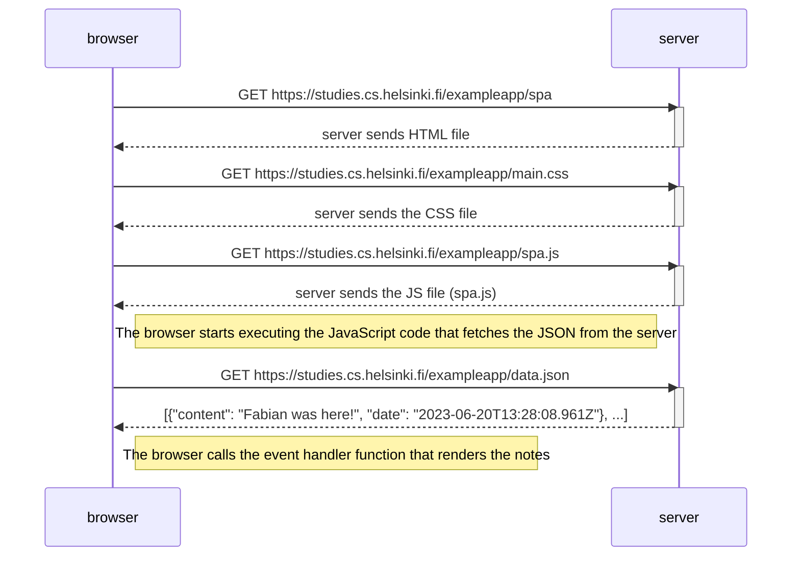

```mermaid
sequenceDiagram
    participant browser
    participant server


    browser->>server:  GET https://studies.cs.helsinki.fi/exampleapp/spa
    activate server
    server-->>browser: server sends HTML file
    deactivate server

    browser->>server: GET https://studies.cs.helsinki.fi/exampleapp/main.css


    activate server
    server-->>browser: server sends the CSS file
    deactivate server

    browser->>server: GET https://studies.cs.helsinki.fi/exampleapp/spa.js
    activate server
    server-->>browser: server sends the JS file (spa.js)
    deactivate server


    Note right of browser: The browser starts executing the JavaScript code that fetches the JSON from the server

    browser->>server: GET https://studies.cs.helsinki.fi/exampleapp/data.json
    activate server
    server-->>browser: [{"content": "Fabian was here!", "date": "2023-06-20T13:28:08.961Z"}, ...]
    deactivate server

    Note right of browser: The browser calls the event handler function that renders the notes


```
